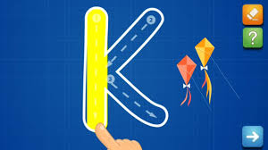

# AbcTrace

## Background and overview

Reading and writing difficulties among young children during the pandemic is becoming a major concern. Since most language development is done through handwritten sheets and practice books in school , Technology driven games such as ABCYA https://www.abcya.com/games/letter_trace and THE Learning APPs https://www.thelearningapps.com/alphabet-tracing-game-for-kids/ have become essential in teaching children these important lessons. AbcTrace is inspired by these games, its a tool that allows users to practice tracing letters which evenutally will facilitate reading and writing acquisition in young children.

## Functionality and MVPs

In AbcTrace, users will be able to:

- [ ] Trace letters using the mouse or finger on a touchscreen
- [ ] If the stroke goes outside the boundary of the letter the user will be prompted to try again
- [ ] if the stroke occupies a pre determined area of the letter a success message is broadcasted

In addition, this project will include:

- [ ] An 'About' explaining how the app works.

## Wireframe & file structure

### Wireframe

### File structure

/design_docs
/src

- /assets
  - empty for right now.
- index.html

- /styles - index.scss - \_reset.scss
- .gitignore

- package.json
- README.md
- webpack.common.js
- webpack.dev.js
- webpack.prod.js

## Architecture and technology

- `JavaScript` for game logic
- `Canvas API` for rendering
- `Webpack` for bundling files
- `CSS` for styling

## Implementation timeline

- Research APIs and setup webpack ~ 1 day
- game/tool logic ~ 1.5 days
- Styling and hosting - 1.5 days

## Bonus features

- simple words to trace
- users can choose a color to trace with
- background music
